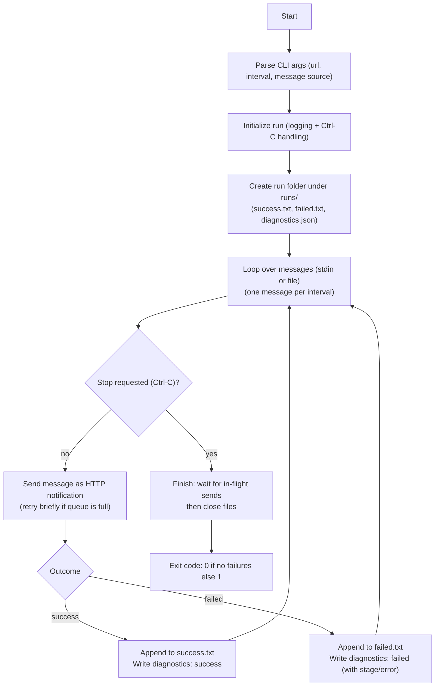

# Program flow

This document describes the high-level runtime flow of the `message-it` CLI.

```mermaid
flowchart TD
  A[Start] --> B["Parse CLI args (url, interval, message source)"];
  B --> C["Initialize run (logging + Ctrl-C handling)"];
  C --> D["Create run folder under runs/<br/>(success.txt, failed.txt, diagnostics.json)"];
  D --> E["Loop over messages (stdin or file)<br/>(one message per interval)"];

  E --> F{"Stop requested (Ctrl-C)?"};
  F -- yes --> K["Finish: wait for in-flight sends<br/>then close files"];
  F -- no --> G["Send message as HTTP notification<br/>(retry briefly if queue is full)"];

  G --> H{"Outcome"};
  H -- success --> I["Append to success.txt<br/>Write diagnostics: success"];
  H -- failed --> J["Append to failed.txt<br/>Write diagnostics: failed (with stage/error)"];
  I --> E;
  J --> E;

  K --> L["Exit code: 0 if no failures else 1"];
```
